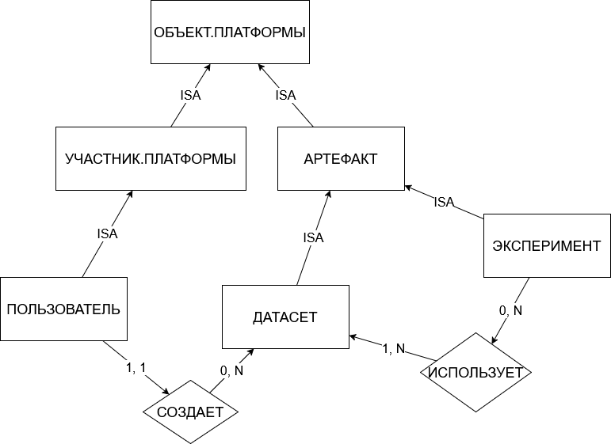

## 1. Выбор и описание фрагмента предметной области

**«Платформа управления датасетами и аналитическими экспериментами»**.

Платформа предназначена для хранения наборов данных и проведения аналитических экспериментов. В выбранном фрагменте рассматриваются пользователи, датасеты и эксперименты. Пользователь может создавать датасеты, а эксперименты могут использовать датасеты для проведения анализа.

### Выбранные понятия

| № | Понятие | Описание |
|---|---|---|
| 1 | `ОБЪЕКТ.ПЛАТФОРМЫ` | общий класс всех объектов |
| 2 | `УЧАСТНИК.ПЛАТФОРМЫ` | объект платформы, который может выполнять действия |
| 3 | `АРТЕФАКТ` | объект платформы, являющийся результатом работы или используемый в работе |
| 4 | `ПОЛЬЗОВАТЕЛЬ` | участник платформы, который создаёт датасеты и работает с экспериментами |
| 5 | `ДАТАСЕТ` | набор данных, используемый для анализа |
| 6 | `ЭКСПЕРИМЕНТ` | аналитический запуск или исследовательское действие, выполняемое с использованием датасета |

### ISA-иерархия понятий

```text
УЧАСТНИК.ПЛАТФОРМЫ ISA ОБЪЕКТ.ПЛАТФОРМЫ;
АРТЕФАКТ ISA ОБЪЕКТ.ПЛАТФОРМЫ;

ПОЛЬЗОВАТЕЛЬ ISA УЧАСТНИК.ПЛАТФОРМЫ;

ДАТАСЕТ ISA АРТЕФАКТ;
ЭКСПЕРИМЕНТ ISA АРТЕФАКТ.
```

### Выбранные связи

| № | Связь | Описание |
|---|---|---|
| 1 | `СОЗДАЕТ` | пользователь создает датасет |
| 2 | `ИСПОЛЬЗУЕТ` | эксперимент использует датасет |


## 2. ER-диаграмма


